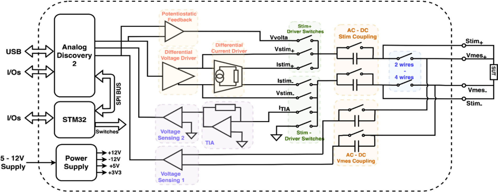
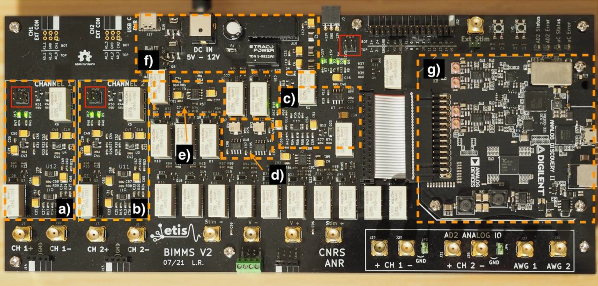
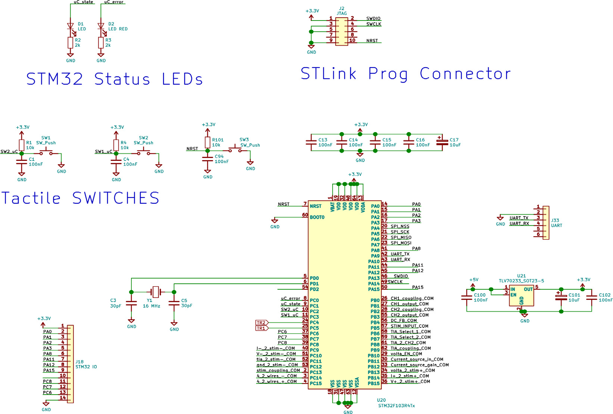

Build your own BIMMS
====================

BIMMS is an open-hardware platform for biological tissue and electrode--tissue
interface electrical characterization. The system combines a custom motherboard,
an embedded STM32 microcontroller, and a Digilent Analog Discovery 2 used as a
daughter board for waveform generation, acquisition, and digital I/O control.

The HardwareX article presents BIMMS as a low-cost, compact, USB-controlled,
open-source platform supporting potentiostatic and galvanostatic electrical
impedance spectroscopy (EIS) up to 10 MHz, as well as cyclic voltammetry. The
public repository provides both the hardware design files and the firmware
needed to reproduce the system.

.. note::

   This page is intended as a practical build guide for researchers who want to
   fabricate, assemble, flash, and validate their own BIMMS platform. It
   complements the repository and the paper, but does not replace them.

System overview
---------------

At the architectural level, the BIMMS platform comprises six functional blocks:

* an Analog Discovery 2 (AD2) used for analog-to-digital conversion,
  digital-to-analog conversion, digital processing, and digital I/O,
* an analog differential excitation front end capable of voltage-controlled and
  current-controlled stimulation,
* an analog differential current and voltage readout front end,
* a reconfigurable sample-under-test (SUT) connection matrix for 2-wire, 4-wire,
  AC/DC coupling, and source selection,
* an STM32 microcontroller that configures the relay network and board state,
* a power-supply section generating the required analog and digital rails.

   Functional schematic of the BIMMS platform, showing the AD2, STM32,
   stimulation path, readout path, relay-based routing, and power supplies.
   Extracted from Fig. 4 of the HardwareX paper.

A complete BIMMS setup therefore requires:

* the BIMMS motherboard,
* the embedded STM32 and matching firmware,
* a Digilent Analog Discovery 2,
* a host computer running Digilent WaveForms and Python,
* the :mod:`bimms` Python package.

What is available in the repository
-----------------------------------

The repository exposes two main resource trees for hardware reproduction:

``Hardware/``
   Board design files, manufacturing exports, assembly resources, and static PDF
   views of the design.

``STM32/``
   Firmware projects for the microcontroller mounted on the motherboard.

The HardwareX paper also summarizes the main design files made available for
reproducing the platform. The design bundle includes at least:

* schematic PDF,
* component placement PDF,
* PCB layout PDF,
* KiCad design archive,
* Gerber archive,
* bill of materials archive,
* PCBWay fabrication archive,
* STM32 source archives,
* Python API archive,
* supplementary materials.

In the current GitHub repository, the same logic is reflected by the
``Hardware/`` and ``STM32/`` directories.

Build workflow
--------------

A practical workflow for reproducing BIMMS is:

#. review the design files,
#. order or fabricate the PCB,
#. source the components,
#. assemble the board,
#. perform first electrical checks,
#. flash the STM32 firmware,
#. mount and connect the Analog Discovery 2,
#. install the host software stack,
#. validate the system with the provided Python scripts.

Each stage is described below.

1. Review the design files
--------------------------

If the goal is to reproduce the reference hardware without modification, the
fastest path is to work from the fabrication-ready files and the BOM.

If instead you want to inspect or modify the design, start from the KiCad
project and the exported PDFs before placing any manufacturing order. In
practice, the following documents are the most useful first references:

* ``Schematic.pdf``
* ``component_placement.pdf``
* ``layout.pdf``
* the KiCad project under ``Hardware/KiCAD/``
* the BOM and fabrication bundles under ``Hardware/Assembly/``

The paper reports that the motherboard is implemented as a 4-layer PCB and that
the AD2 can be placed on top of the digital section and secured using spacers.

2. Procurement of parts
-----------------------

The paper's build instructions state that components can be sourced from
standard distributors such as Mouser, Farnell, or DigiKey. Passive parts can be
substituted if needed, but the recommended baseline is:

* at least 1% thin-film resistors,
* 10%, 25 V ceramic capacitors, preferably X7R or C0G when possible,
* tantalum capacitors for larger decoupling values where appropriate.

The paper explicitly advises caution when substituting active components such as
operational amplifiers. If replacements are unavoidable, they should be
pin-compatible and offer similar or better electrical ratings, while
acknowledging that surrounding passive values may need retuning.

3. PCB fabrication
------------------

According to the paper, the board is a 4-layer PCB of approximately
262 mm by 120 mm. The authors recommend using a prototyping service such as
JLCPCB or PCBWay, and specifically note that ENIG finish facilitates placement
and assembly.

For a straightforward build, use one of the fabrication bundles already
provided in the repository:

* the Gerber export for generic PCB manufacturing,
* the PCBWay bundle if you plan to use PCBWay's workflow directly.

4. Board assembly
-----------------

The paper describes two realistic assembly routes:

* outsourced PCB assembly using a prototyping service,
* full or partial manual assembly.

The PCBWay archive is intended to support automated fabrication and SMT
placement. Even when outsourced assembly is used, some through-hole components
and possibly some non-standard references may still require manual soldering.

For manual assembly, the paper recommends:

* ordering a stencil,
* applying solder paste to the pads,
* placing SMT parts using fine tweezers or a vacuum pen,
* reflowing with a reflow oven or vapor phase oven when possible,
* alternatively using hot air, ideally with a hot plate to reduce thermal
  gradients,
* using eutectic tin/lead solder for remaining SMT and through-hole operations,
* using a thin and long tip for relay soldering.

.. warning::

   Do not power the board immediately after assembly. Perform a careful visual
   inspection first, especially around regulators, relays, connectors, and the
   microcontroller area.

5. Initial electrical testing
-----------------------------

The paper provides a concrete first-power procedure. Before applying power:

* unplug everything, including the AD2,
* disconnect the analog blocks by removing jumpers ``J5``, ``J4``, and ``J15``,
* use a benchtop supply with current limiting,
* set the supply between 5 V and 12 V,
* set the current limit to roughly 500--600 mA.

Once powered, the paper indicates that LEDs ``D3``, ``D4``, ``D5``, and ``D28``
should light up. The following voltages should then be verified with a
multimeter:

* ``+12 V`` and ``-12 V`` on connector ``J3``,
* ``3.3 V`` near ``D5``,
* ``5 V`` near ``D28``.

The analog sections can then be powered progressively:

* add jumpers on ``J5`` to power channel 1 and verify LEDs ``D10`` and ``D13``,
* check approximately ``+11.3 V`` across ``C19`` and ``-11.3 V`` across ``C21``,
* confirm that no abnormal heating occurs on ``U4``, ``U6``, ``U9``, or ``U12``,
* repeat the same logic for channel 2 by adding jumpers on ``J4``,
* finally add jumpers on ``J15`` to power the excitation block and verify
  LEDs ``D18`` and ``D19``,
* check approximately ``+11.3 V`` across ``C72`` and ``-11.3 V`` across ``C75``.

The paper notes that ``U10`` and ``U15`` may become moderately warm
(approximately 50--55 °C), whereas the other devices should not show
excessive temperature rise.

   Main functional blocks highlighted on the BIMMS motherboard. The paper uses
   this figure to guide the initial power-up sequence and shows the jumpers
   ``J4``, ``J5``, and ``J15`` to remove before testing the supplies.
   Extracted from Fig. 16 of the HardwareX paper.

6. STM32 firmware and digital control
-------------------------------------

The motherboard uses an STM32F103 microcontroller to drive the electromechanical
relays and manage the board state. The paper describes the digital control
section as follows:

* the STM32 runs from an external 16 MHz crystal,
* the CPU is clocked at 72 MHz using the internal PLL,
* a 1.27 mm 10-pin SWD header is provided for programming,
* two LEDs are available for direct control by the microcontroller,
* a full-duplex SPI bus connects the AD2 to the STM32, with the AD2 acting as
  master and the STM32 as slave,
* an auxiliary UART header is also available.

   Digital control circuitry of the BIMMS motherboard, including the STM32,
   reset path, LEDs, switches, SWD programming header, and auxiliary UART.
   Extracted from Fig. 14 of the HardwareX paper.

The paper describes several relay-controlled board states exposed by the STM32:

``Off_state``
   Default state after power-up. Relay configuration changes are not permitted.

``Idle_state``
   Configuration state in which relay values can be modified.

``Locked_state``
   Measurement state in which the current configuration is preserved.

``Error_state``
   Fault state. The paper states that errors can be cleared by returning the
   STM32 to ``Off_state``.

The paper also documents the SPI register format and a relay map used by the
firmware. This is useful if you later want to understand how the Python API and
the microcontroller cooperate to configure the board.

7. Flashing the STM32
---------------------

The paper states that two programming routes are provided:

* an MBED-based project and binary archive,
* an STM32CubeIDE / CubeMX-based project archive.

In the current GitHub repository, the ``STM32/`` directory provides CubeIDE
projects for multiple STM32F103 variants as well as an ``mbed/`` source tree.

For a first build, a practical flashing procedure is:

#. identify the exact STM32 variant mounted on your board,
#. connect an ST-Link programmer or a compatible SWD interface,
#. open the matching STM32 project,
#. build and flash the firmware,
#. keep the board powered during the flashing process.

The paper explicitly notes two programming approaches:

* programming from MBED Studio, or
* copying the generated binary to the ST-Link USB storage target.

After successful programming, LED ``D1`` should blink at approximately 1 Hz.

8. Mount the Analog Discovery 2
-------------------------------

The AD2 is used as the USB-connected daughter board that handles generation,
acquisition, and low-level host interfacing. The paper explains that the AD2 can
be mounted on top of the digital section and secured with spacers.

Mechanically and electrically, this is a critical integration step, so verify
alignment against:

* the schematic,
* the component-placement PDF,
* the PCB layout,
* the hardware repository files.

Do not proceed to software validation until the board powers correctly and the
STM32 has been programmed successfully.

9. Host-side software setup
---------------------------

Once the hardware is assembled and the STM32 is running, prepare the host
computer.

The paper states that:

* Digilent WaveForms must be installed separately,
* the BIMMS Python API can be installed with ``pip``,
* the board can then be validated using the supplied Python test scripts.

A minimal host-side setup is therefore:

.. code-block:: bash

   pip install bimms

You should also install Digilent WaveForms according to Digilent's
recommendations for your operating system.

10. Validate the system
-----------------------

The paper recommends testing the board from a computer after the firmware has
been flashed. The provided validation scripts reportedly include a global
``test_all.py`` entry point and a set of unitary tests covering:

* communication with the AD2,
* communication between the AD2 and STM32,
* channel output behavior,
* other board functions.

Only once those tests pass without error does the paper recommend replacing the
current-limited benchtop supply with the normal USB-C or DC-barrel power input.

Suggested first-use sequence
----------------------------

After successful assembly and flashing, a good first-use sequence is:

#. verify power rails and LED indicators,
#. confirm that the STM32 firmware is alive,
#. connect the AD2,
#. install WaveForms and the Python package,
#. run the provided validation scripts,
#. execute a simple reference measurement,
#. inspect the response before moving on to biological samples.

References
----------

Regnacq, L., Bornat, Y., Romain, O., and Kölbl, F.
*BIMMS: A versatile and portable system for biological tissue and
electrode-tissue interface electrical characterization*.
HardwareX 13 (2023), e00387.
DOI: 10.1016/j.ohx.2022.e00387

Public repository:
https://github.com/Neuro-Interface-Lab/BIMMS

Source files repository cited by the paper:
https://doi.org/10.5281/zenodo.7148811
