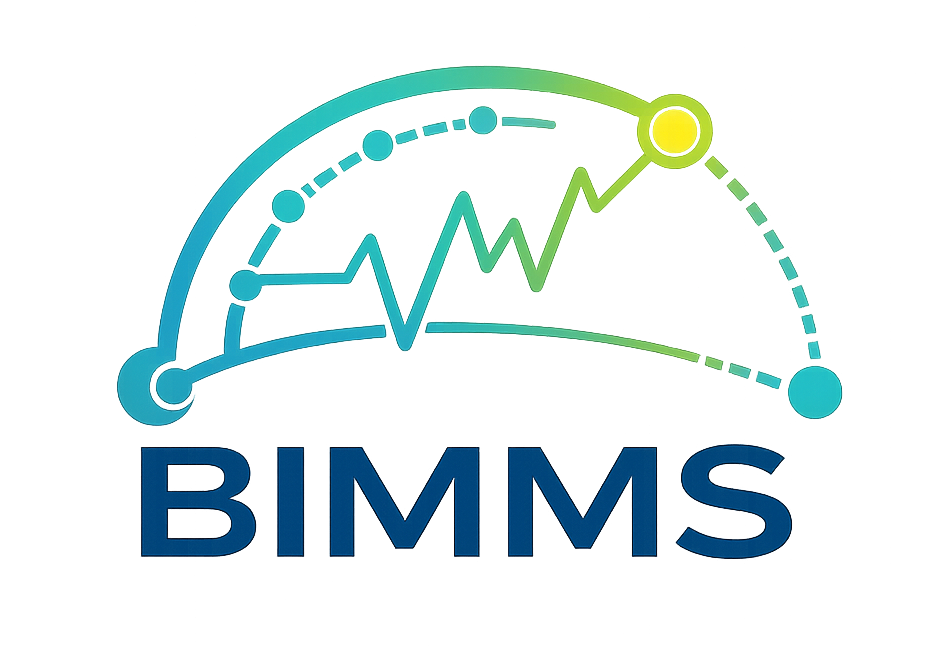

BIMMS documentation
===================

BIMMS is an open-source platform for bioimpedance measurements and related instrumentation workflows.

.. toctree::
   :maxdepth: 2
   :caption: Contents

   installation
   overview
   build_your_own_bimms
   api/index